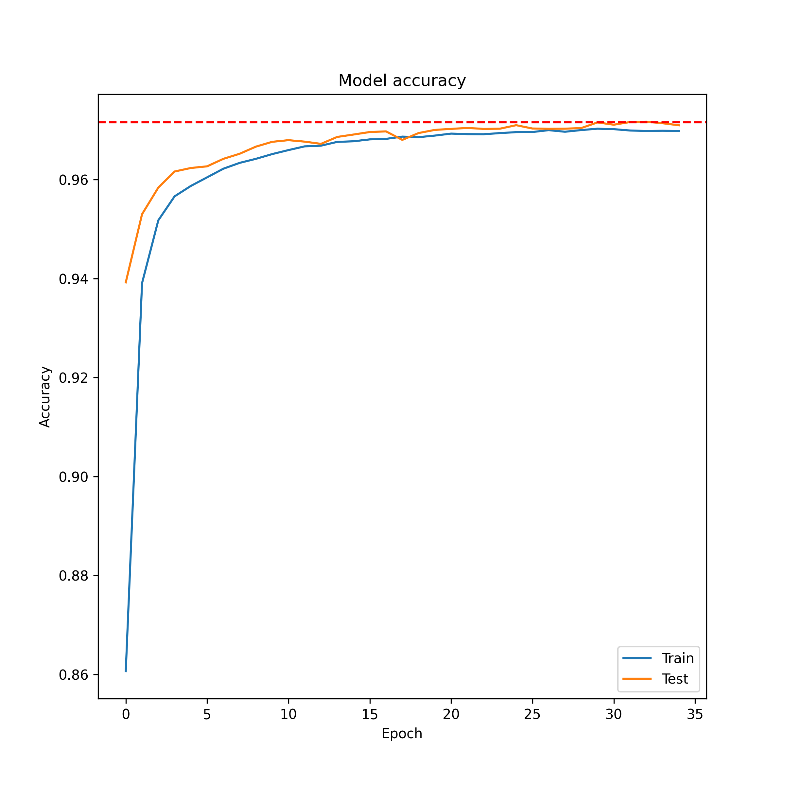

# AstroClassifierML

## Contents
- [Overview](#overview)
- [Technical Features](#technical-features)
- [Machine Learning Models](#machine-learning-models)
- [Files Description](#files-description)
- [Output](#output)
- [Acknowledgements](#acknowledgements)

## Overview
AstroClassifierML is a machine learning project aimed at classifying space objects. It uses data from Sloan Digital Sky Survey, applying advanced machine learning techniques to classify Galaxies, Stars, and Quasars.

## Technical Features

- **TensorFlow and Scikit-Learn for Machine Learning**: This project employs TensorFlow for building and training neural network models and Scikit-Learn for SVM model implementation and data preprocessing.
- **Pandas for Data Handling**: Utilises Pandas for data manipulation, enabling efficient data operations.
- **Data Preprocessing**: Features data preprocessing techniques like feature scaling, outlier removal, and handling imbalanced datasets using SMOTE.
- **Model Optimisation and Evaluation**: Uses the Adam optimiser for the neural network and evaluates models based on accuracy metrics.
- **Regularisation Techniques**: Applies dropout in neural networks to prevent overfitting and ensure model generalisability.

## Machine Learning Models

- **Deep Neural Network (DNN) Model**: 
  - Architected with dense layers and dropout for regularisation.
  - Utilises Early Stopping to monitor training performance.
- **Support Vector Machine (SVM) Model**: 
  - Implemented using Scikit-Learn's `svm.SVC` with an RBF kernel.
  - Optimised with hyperparameter tuning.

## Files Description
- `main.py`: Main script for executing the machine learning workflow, including data preprocessing, model training, and evaluation.
- `data_handler.py`: Script for data extraction and preprocessing. Handles tasks like data cleaning and feature engineering.
- `models.py`: Contains the implementation of the DNN and SVM models.

## Output

The script outputs the accuracy of the models and generates a plot (model_accuracy_plot.png) showing the training and validation accuracy of the DNN model over epochs.

## Acknowledgements

Sloan Digital Sky Survey

## [Back to Top](#AstroClassifierML)